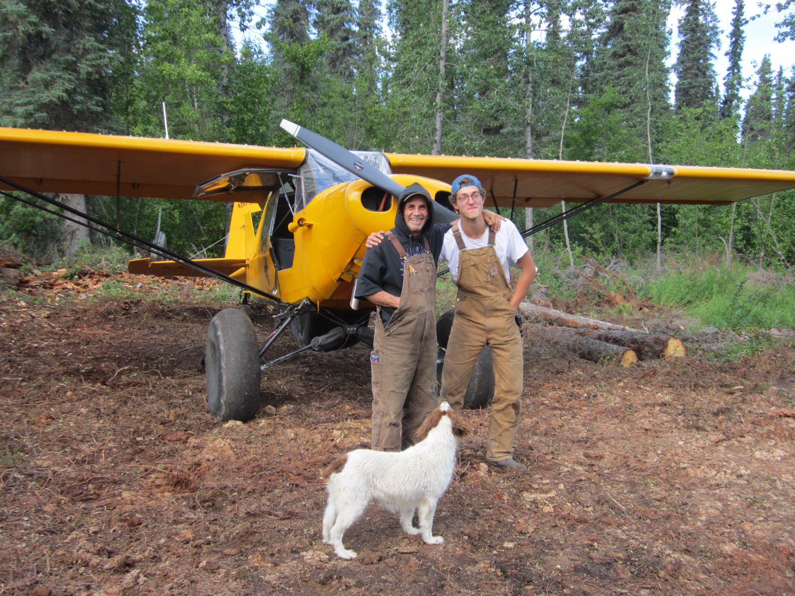

# **Jordan Taranto**
## Explorer | Pilot | Scuba Diver | Engineer

Hey there, I'm Jordan Taranto, a scuba diver, wannabe pilot, and engineer with a passion for innovation and exploration. Whether I'm coding in Python or navigating the skies/ocean, I thrive on tackling challenges head-on and pushing the boundaries of what's possible. 

A photo of me with with my boss Robert Kinkade (rest in peace). I spent three and a half months in the Alaskan wilderness living in a tent and flying all over Alaska with him.

---
# Test Pilot School 
As a Research Fellow at the United States Air Force Test Pilot School, I had the privilege of working on drones and working with some of the best pilots in the world. I focused on building a modular platform to aid in teaching students of the Air Force Test Pilot School the flight characteristics of drones. Here are some photos of my time there 

Here I am in my office working in front of the famous [X15 ](https://en.wikipedia.org/wiki/North_American_X-15) which if you did not know was the fastest plane ever built. 

Here I am with my professor Dr. Mujahid Abdulrahim in front of an [F-16](https://en.wikipedia.org/wiki/General_Dynamics_F-16_Fighting_Falcon). 

[X-62 Vista](https://en.wikipedia.org/wiki/General_Dynamics_X-62_VISTA) here is the X-62 VISTA which my boss led. This aircraft is one of the greatest pieces of technology right now. Utilizing the power of AI to fly autonomously. 

---
# Missouri Institute for Defense and Energy (MIDE)
At the Missouri Institute for Defense and Energy, I focused on optimizing flight performance for unmanned aerial systems. Leveraging Docker and my coding knowledge, I streamlined software testing processes and enhanced user experience for different missions.

Here I am with my professor once again and some colleagues 

Here is a photo of me presenting on some of my research where I built a flight envelope supervisor. 

With my background as a licensed scuba-diver, I bring a unique perspective to every project, combining technical expertise with real-world flying and scuba experience. Whether I'm in the cockpit in my wetsuit or behind a computer screen, my goal is always the same: to push the boundaries of innovation and make a meaningful impact.

Thanks for reading! 